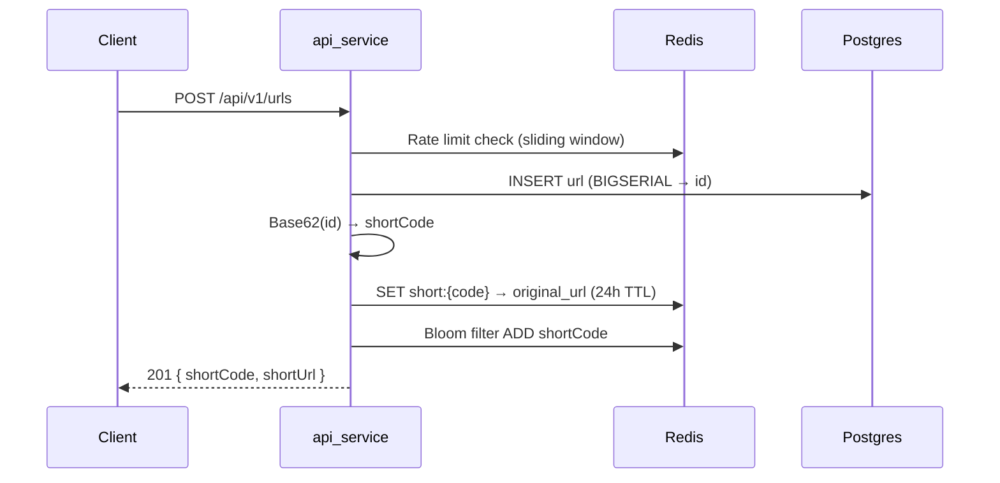
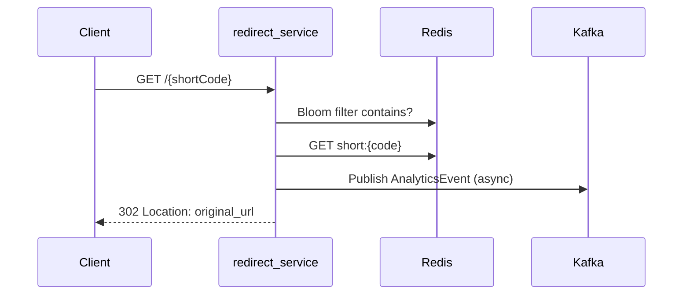
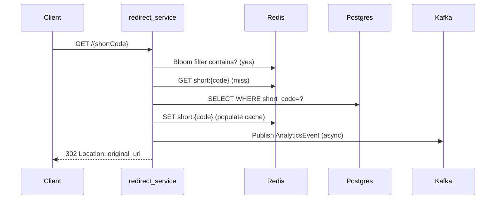

# Technical Specification — URL Shortener System

**Version:** 1.0.0  
**Last Updated:** 2025-01-01

---

## System Overview

A high-performance URL shortener built as a modular monolith — three independently deployable Spring Boot services (write/read/async) sharing a common module and infrastructure starters.

**Stack:** Java 25, Spring Boot 4.0.6, WebFlux, R2DBC, Redis, Kafka, Avro, PostgreSQL

### Services

| Service            | Port | Role                                                 |
| ------------------ | ---- | ---------------------------------------------------- |
| `api_service`      | 8080 | URL creation, auth, user management (write path)     |
| `redirect_service` | 8081 | Short-code resolution, 302 redirects (read path)     |
| `analytics_worker` | 8082 | Kafka consumer, batch analytics inserts (async path) |

### Architecture Diagram

```
Client → Cloudflare CDN → NGINX
  → redirect_service: Bloom filter → Redis cache → Postgres → 302
  → api_service: REST API → Postgres + Redis → Kafka (Avro analytics events)
                                                    ↓
                                           analytics_worker (batch insert)
```

---

## Project Structure

```
services/
├── api_service/              # Write path — auth, URL CRUD, user mgmt
├── redirect_service/         # Read path — high-throughput redirect
├── analytics_worker/         # Async Kafka consumer
├── common/                   # Shared: models, DTOs, exceptions, mappers, Avro
└── starters/
    ├── kafka_starter/        # Kafka producer/consumer + Avro auto-config
    ├── postgres_starter/     # R2DBC defaults (no custom beans)
    ├── redis_starter/        # Redis + @EnableCaching + RBloomFilter
    ├── swagger_starter/      # Springdoc OpenAPI bean
    └── message_starter/      # MessageSource + i18n YAML files
```

---

## Data Flow

### URL Creation



### Redirect (Cache Hit)



### Redirect (Cache Miss → DB)



---

## Short Code Generation

Auto-increment `BIGSERIAL` ID → bytes → Base62 encode → short code.

| ID                | Encoded  |
| ----------------- | -------- |
| 0                 | `0`      |
| 1,000,000         | `4c92`   |
| 3,521,614,606,208 | `zzzzzz` |

**Library:** `io.seruco.encoding:base62` (alphabet: `0-9`, `a-z`, `A-Z`)

**Utility:** `io.lvoxx.ssurl.common.util.NumberToBytes` converts `long`/`int` to big-endian byte arrays.

---

## Caching Strategy

### Layers (ordered by check)

1. **Cloudflare CDN** — caches 301 responses at edge (Configurable: Cache Everything + 1h TTL)
2. **Bloom Filter** — Redisson `RBloomFilter<String>` "bloom:urls" (10M capacity, 1% FP rate)
3. **Redis Cache** — Spring `@Cacheable("short-urls")`, key prefix `short:`, 24h TTL
4. **PostgreSQL** — final fallback, populates Redis on miss

### Redis Key Schema

| Key                         | Type                  | TTL    |
| --------------------------- | --------------------- | ------ |
| `short:{code}`              | String (original URL) | 24h    |
| `rate_limit:ip:{ip}`        | Counter               | 60s    |
| `rate_limit:user:{id}`      | Counter               | 60s    |
| `bloom:urls`                | Bloom filter          | No TTL |
| `blacklist:domain:{domain}` | String `"1"`          | 10m    |

### Cache Invalidation

- **URL delete/deactivate**: evict `short:{code}` via `@CacheEvict`
- **URL create**: populate cache via `@CachePut`
- **URL expired**: checked at redirect time; no cache write for expired URLs

**Known issue:** Cache TTL is always 24h regardless of `expireAt`. A URL with `expireAt` in 1 hour may still be served from cache for up to 24h. Fix: compute TTL as `min(24h, expireAt - now)`.

---

## Database Schema

### Tables

| Table              | Key Features                                                                                                      |
| ------------------ | ----------------------------------------------------------------------------------------------------------------- |
| `users`            | BIGSERIAL PK, unique email/username, BCrypt password, role (USER/ADMIN)                                           |
| `urls`             | BIGSERIAL PK, unique short_code, FK → users (SET NULL on delete), is_active, click_count, expire_at, audit fields |
| `refresh_tokens`   | BIGSERIAL PK, FK → users (CASCADE delete), token, expires_at, is_revoked                                          |
| `analytics`        | Partitioned by RANGE(created_at) monthly, no FK to urls (performance)                                             |
| `domain_blacklist` | BIGSERIAL PK, unique domain, reason                                                                               |

### Audit Entity Hierarchy

```
BaseCAtEntity (created_at)
├── BaseCAtCByEntity (+ created_by, default "Annonymous")
│   └── BaseCAtCByUAtUByEntity (+ updated_at, updated_by, default "Annonymous")
└── BaseCAtUAtEntity (+ updated_at)
```

---

## Analytics Pipeline

### Kafka Topic: `analytics-events`

| Property    | Value                 |
| ----------- | --------------------- |
| Partitions  | 3                     |
| Replication | 1 (dev)               |
| Key         | shortCode             |
| Value       | Avro `AnalyticsEvent` |

### Avro Schema (`common/src/main/avro/AnalyticsEvent.avsc`)

```json
{
  "name": "AnalyticsEvent",
  "fields": [
    { "name": "shortCode", "type": "string" },
    { "name": "ip", "type": "string" },
    { "name": "userAgent", "type": ["null", "string"], "default": null },
    { "name": "referer", "type": ["null", "string"], "default": null },
    { "name": "createdAt", "type": "long", "logicalType": "timestamp-millis" }
  ]
}
```

### Consumer Behavior

- Batch listener: up to 500 records per poll
- Manual ack mode (commit after successful batch insert)
- `@Transactional` batch insert via `saveAll()`

---

## Error Handling

All business errors are communicated via typed exceptions extending `AppException` (in `common`):

| Exception                    | HTTP Status | Message Key                |
| ---------------------------- | ----------- | -------------------------- |
| `ShortCodeNotFoundException` | 404         | `error.shortcode.notfound` |
| `UrlExpiredException`        | 410         | `error.shortcode.expired`  |
| `UrlNotFoundException`       | 404         | `error.url.notfound`       |
| `DomainBlacklistedException` | 400         | `error.domain.blacklisted` |
| `RateLimitExceededException` | 429         | `error.ratelimit.exceeded` |
| `UnauthorizedException`      | 401         | `error.unauthorized`       |
| `UserNotFoundException`      | 404         | `error.user.notfound`      |
| `UserAlreadyExistsException` | 409         | `error.user.alreadyexists` |

Each service has a `GlobalExceptionHandler` (`@RestControllerAdvice`) that maps exceptions to `ProblemDetail` (RFC 9457) responses with i18n messages from `MessageSource`.

---

## Security

- **JWT Access Token**: 15 min (configurable), HMAC-SHA signed, stored in-memory
- **JWT Refresh Token**: 7 days (configurable), stored in HTTP-only cookie
- **Password hashing**: BCrypt with cost factor 12
- **Rate limiting**: Redis sliding window (IP and per-user) — not yet implemented

### Public Endpoints

- `POST /api/v1/auth/register`
- `POST /api/v1/auth/login`
- `POST /api/v1/urls` (URL creation is public, anonymous users get 7-day TTL)
- `GET /{shortCode}` (redirect)
- Swagger UI

---

## Testing Strategy

| Layer          | Framework                                                   | Coverage         |
| -------------- | ----------------------------------------------------------- | ---------------- |
| Unit (service) | JUnit 5 + Mockito + StepVerifier                            | Core logic       |
| Repository     | @DataR2dbcTest + Testcontainers (PostgreSQL + Redis)        | DB interactions  |
| Controller     | Plain Mockito (no @WebFluxTest — unavailable in Boot 4.0.6) | Request/response |
| Integration    | Testcontainers                                              | Full flows       |

Testcontainers support is provided by `test_starter` with reusable abstract classes (`AbstractPostgresContainer`, `AbstractRedisContainer`) and `NoCacheLoadConfig` for disabling cache in tests.
